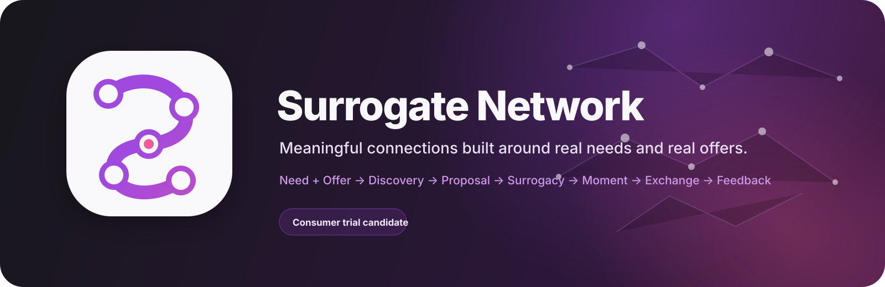

# Surrogate Network

Surrogate Network is a needs-based social companion platform for meaningful exchanges of support, companionship, and capability.

The canonical relationship loop is:

```text
Need + Offer -> Discovery -> Proposal -> Surrogacy -> Moment -> Exchange -> Feedback
```

The product is hardened for controlled consumer trials with real persistence, explicit authority boundaries, production-oriented account lifecycle controls, runtime observability, health/readiness semantics, recovery proof, and exact-head release gates. That does **not** mean every roadmap feature or deployment-owner control is complete for unrestricted public-market launch.

## Real product screenshots

These screenshots come from the same Playwright consumer-trial path that exercises real persistence and the canonical two-member lifecycle. The committed WebP files are reviewed, web-optimized derivatives of exact-head runtime captures, not mockups or marketing comps.

| Public entry | Published Need |
| --- | --- |
|  |  |

| Incoming Proposal | Completed Exchange |
| --- | --- |
|  |  |

See [`docs/VISUAL_EVIDENCE.md`](docs/VISUAL_EVIDENCE.md) for screenshot provenance, regeneration rules, source-artifact evidence, and brand-asset usage.

## Trial-ready product surface

### Public

- Landing, How It Works, Explore, Principles, and Safety surfaces.
- Sign up and sign in through Supabase Auth.
- Password recovery through Supabase email + PKCE callback exchange.
- Trial Terms and Privacy Notice.
- Public profile projection that excludes private/account-authority fields.

### Member

- Explicit trial age/Terms/Privacy consent.
- Needs and Offers creation and management.
- Discovery across active marketplace records.
- Proposal creation and proposal state transitions.
- Surrogacy/Connection creation after accepted proposals.
- Moment scheduling and completion.
- Exchange recording.
- Exchange-bound Feedback.
- Member blocking and safety reporting.
- Account settings and reversible trial deactivation.
- Machine-readable account export.
- Password-confirmed permanent account deletion with retained tombstone/history boundaries.

Messaging and Rewards are intentionally absent from primary member navigation until their production behavior is complete. Existing non-primary routes must remain truthful about their availability rather than simulate data.

### Admin

- Separate authorized admin console.
- Global operational counts through trusted server authority.
- Report moderation queue.
- Atomic moderation outcomes, restrictions/suspensions, and audit events.

## Canonical architecture

- **Framework:** Next.js 16, React 19, TypeScript.
- **Data/Auth:** Supabase Auth + PostgreSQL + Row Level Security.
- **Storage/Realtime:** not a generic requirement. A future shipped feature must own an explicit object/realtime lifecycle before adopting these services.
- **Domain:** `src/domain`.
- **Application orchestration:** `src/application`.
- **Repository contracts:** `src/repositories`.
- **Supabase adapters:** `src/infrastructure/supabase`.
- **Runtime configuration:** `src/infrastructure/config`.
- **Observability:** `src/infrastructure/observability`.
- **Operations/health:** `src/infrastructure/health`, `src/infrastructure/operations`, and `/api/health/*`.
- **UI surfaces:** `src/app` and `src/components`.
- **Navigation authority:** `src/navigation`.
- **Database history:** `supabase/migrations`.
- **Tests:** Jest, Testing Library, Playwright.
- **Release gate:** GitHub Actions.

Firebase and Genkit are not part of the current architecture. Production runtime must not fall back to mock, demo, sample, or invented consumer data.

## Local development

### Prerequisites

- Node.js 22 or newer.
- npm.
- Docker.
- Supabase CLI for the local database/auth stack.

### Start with a real local Supabase runtime

```bash
npm ci
supabase start
cp .env.example .env.local
```

Populate `.env.local` with the values reported by the local Supabase runtime:

```env
NEXT_PUBLIC_SUPABASE_URL=...
NEXT_PUBLIC_SUPABASE_ANON_KEY=...
SUPABASE_SERVICE_ROLE_KEY=...
```

Then rebuild the local database from canonical migrations and start Next.js:

```bash
supabase db reset --no-seed
npm run dev
```

The application listens on `http://localhost:9002` in development.

`SUPABASE_SERVICE_ROLE_KEY` is server-only. Never expose it to client components, browser bundles, public logs, screenshots, or committed files.

See [`STARTUP.md`](STARTUP.md) for the startup sequence and failure checks.

## Runtime health

- `GET /api/health/live` reports process liveness without depending on Supabase.
- `GET /api/health/ready` validates required server configuration and the real anonymous Supabase data plane.
- Both are dynamic/no-store and retain request-correlation headers.
- Health responses expose only a sanitized release revision when deployment metadata is available.

Readiness must fail when the dependency is unusable. It is not a decorative always-green endpoint.

## Test and quality commands

```bash
npm run typecheck
npm run lint
npm run test:unit
npm run test:component
npm run test:security
npm run test:navigation
npm run build
npm run test:e2e:smoke
npm run test:a11y
```

The CI quality rail includes:

- INSTALL
- DEPENDENCY AUDIT
- TYPECHECK
- LINT
- UNIT
- COMPONENT
- SECURITY
- NAVIGATION
- BUILD
- E2E TRIAL
- A11Y
- QUALITY GATE

SECURITY starts a fresh Supabase runtime, replays all migrations, runs the logical application-data recovery drill, runs security regressions, regenerates canonical database types, and rejects schema/type drift.

E2E TRIAL proves the canonical two-member journey against a freshly migrated database, captures the source PNG documentation evidence from that real runtime, uploads it for review, and exercises the deployment verification contract against an exact local production build.

## Deployment verification

A hosted deployment must be checked independently from repository CI.

Run **Deployment Verification** from GitHub Actions on the exact revision intended to be live and provide the canonical target deployment origin. The workflow rejects redirects to a different route/origin and rejects a target whose reported release revision does not equal the exact workflow SHA.

Manual equivalent:

```bash
npm run verify:deployment -- https://app.example.com <exact-git-sha>
```

The verifier is read-only. It checks same-origin/no-redirect responses, liveness, dependency readiness, exact revision provenance, request correlation, health caching/cookie behavior, public auth/recovery surfaces, CSP, anti-framing/content-sniffing/referrer/permissions headers, and HSTS.

If the hosting provider does not expose `VERCEL_GIT_COMMIT_SHA` or `GITHUB_SHA` to the runtime, set the non-secret `SURROGATE_RELEASE_SHA` to the exact deployed git revision.

See [`docs/OPERATIONS_RUNBOOK.md`](docs/OPERATIONS_RUNBOOK.md).

## Recovery

The SECURITY rail runs `scripts/recovery-drill.sh`, which proves that canonical migrations plus a logical application-data dump can recover the application-owned `public` relational dataset.

That drill does not prove Supabase-managed Auth, provider backup/PITR policy, or a full production project restore. See [`docs/PRODUCTION_RECOVERY.md`](docs/PRODUCTION_RECOVERY.md).

## Verified parent evidence for the active operations slice

The active deployment-operations slice started from merged `master` commit:

```text
db2675221f6b81b8621088a8732b5c42f40dc8b6
```

Post-merge CI run **#272** passed on that parent, including the recovery drill, SECURITY, zero schema/type drift, BUILD, E2E TRIAL, A11Y, and QUALITY GATE.

This records the independently verified parent, not a permanently self-updating “latest SHA.” Each later candidate/merge must earn its own exact-head evidence in GitHub Actions and its PR record.

## Readiness boundary

The repository covers the core consumer lifecycle, account recovery/export/deletion, structured runtime error observability, request correlation, runtime configuration ownership, liveness/readiness, logical application-data recovery, and exact-head CI.

Remaining unrestricted-launch work is primarily deployment/governance/operations-specific:

- protect the default branch and require the aggregate `QUALITY GATE` before merge;
- run Deployment Verification against the actual hosted production target and exact release revision;
- record the real Supabase backup/PITR policy and perform a provider-level restore rehearsal;
- verify real outbound password-recovery email delivery/domain configuration;
- assign external alerting, on-call/support, moderation, and incident ownership;
- complete any organization-specific privacy/compliance/support process;
- complete Messaging and Rewards before promoting them into primary product navigation.

The dormant media metadata subsystem was deliberately removed rather than presented as a production Storage feature. A future media feature must begin with an explicit private object ownership/access/deletion/recovery contract.

## Repository structure

```text
src/
  app/                 public, member, admin, auth, and health route surfaces
  application/         use-case orchestration and server actions
  components/          UI and feature components
  domain/              canonical business definitions
  infrastructure/      config, health, observability, operations, Supabase adapters
  navigation/          canonical navigation registry
  repositories/        persistence interfaces
  __tests__/           security and regression coverage
supabase/
  migrations/          canonical database/security history
scripts/                recovery, workflow-integrity, and deployment-verification tooling
e2e/                   Playwright trial and accessibility coverage
docs/                  architecture, operations, recovery, development, visual evidence, and manifest docs
```

## Project rules

- Real runtime logic only. No silent demo fallback.
- One canonical implementation per responsibility.
- Privileged state is server/database authoritative.
- RLS is enforced, not decorative.
- Schema changes are migrations.
- Public, member, and admin concerns remain separated.
- Exact-head CI evidence is required before merge/release claims.
- A hosted release must be tied to an immutable deployed revision before certification.
- Documentation must describe the repository that actually exists.
- Product screenshots used by repository documentation must originate from the real E2E runtime, be reviewed, and only then be promoted into durable docs assets.

Read [`docs/PROJECT_MANIFEST.md`](docs/PROJECT_MANIFEST.md) for the full methodology and release definitions.

## Documentation

- [Project Manifest](docs/PROJECT_MANIFEST.md)
- [Architecture](docs/ARCHITECTURE.md)
- [Visual Evidence & Brand Assets](docs/VISUAL_EVIDENCE.md)
- [Production Operations](docs/OPERATIONS_RUNBOOK.md)
- [Production Recovery](docs/PRODUCTION_RECOVERY.md)
- [Development Guide](docs/DEVELOPMENT.md)
- [API Reference](docs/API.md)
- [Data Models](docs/DATA_MODELS.md)
- [Contributing](docs/CONTRIBUTING.md)
- [Current Sprint Status](SPRINT_PROGRESS.md)
