# Visual Evidence and Brand Assets

Surrogate Network documentation separates brand artwork from runtime product evidence. The two must never be confused.

## Brand assets

Canonical documentation identity lives in `docs/assets/`:

- `surrogate-network-mark.svg` — reusable logo mark.
- `surrogate-network-banner.svg` — README/documentation header.

These assets use the same brand colors already defined by the application UI: royal violet (`#A049DF`), vibrant pink (`#F25A99`), supporting violet (`#CC99E6`), and the neutral product background (`#F9F9FB`).

## Runtime screenshot authority

The screenshot source of truth is the real Playwright consumer-trial runtime in `e2e/smoke.spec.ts`. The capture path signs in real synthetic trial members, writes to the fresh Supabase database, traverses the shipped member/admin surfaces, and captures the browser after the relevant state exists.

The committed documentation screenshots are now the **exact PNG frames from that runtime artifact**. They are not a stitched showcase, design comp, manually fabricated screen, browserless render, or recompressed derivative.

Current provenance:

- Git revision: `be859bca5a0639c7f8d2472faaa46c2732bad442`
- GitHub Actions run: **#357** (`36179582230`)
- Artifact: `consumer-visual-evidence`
- Artifact digest: `sha256:c5f352d8143479f6a76e4345345906262989ed7108b9e3b13a1f2a03446e061d`
- Result: complete post-merge CI including SECURITY, BUILD, E2E TRIAL, A11Y, recovery, schema/type drift checks, local deployment verification, and aggregate `QUALITY GATE` passed.

## The 16 real product frames

Each file is deliberately standalone so a reader can understand the product state without decoding a collage.

### Public product understanding

**01 — Public home**

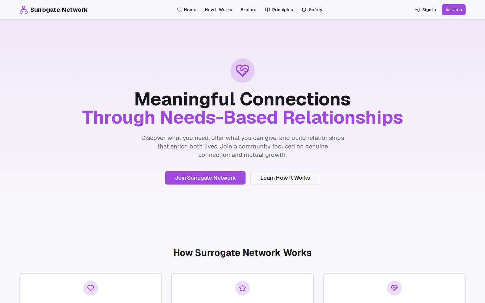

The unauthenticated entry surface introduces the needs-based relationship model and sends people into the real sign-up/sign-in journey.

**05 — How it works**

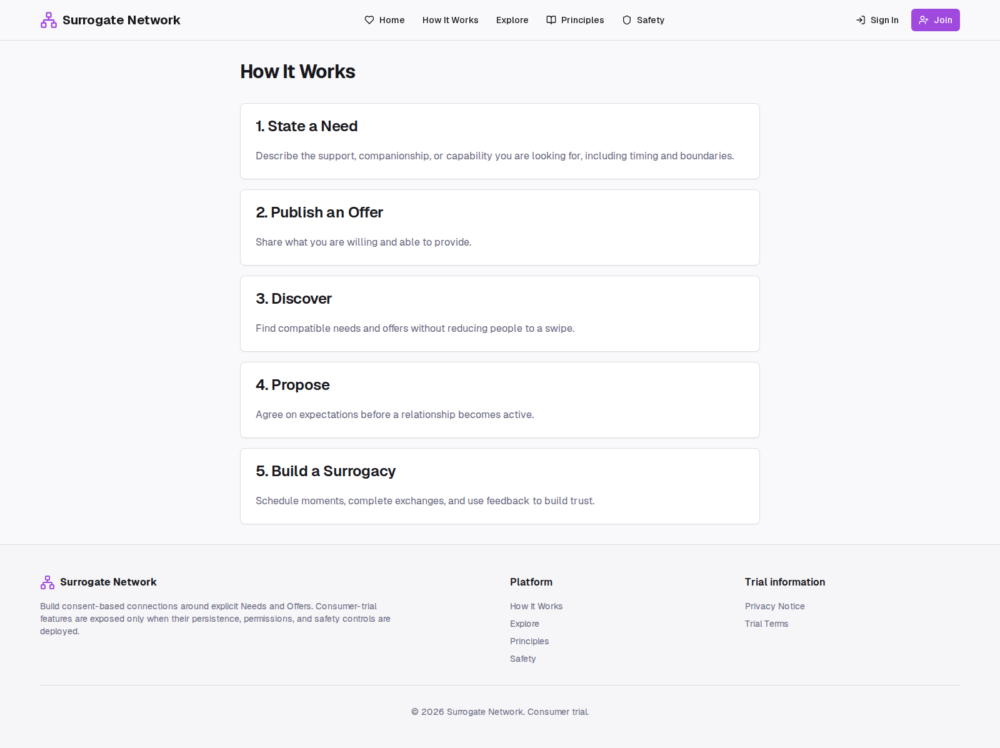

The public lifecycle explanation shows the product flow from Need/Offer through Surrogacy and Exchange.

**06 — Safety**

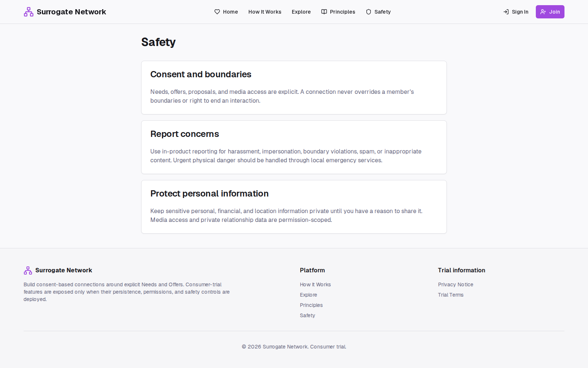

The public safety surface explains consent, boundaries, reporting, and protection expectations.

**16 — Community principles**

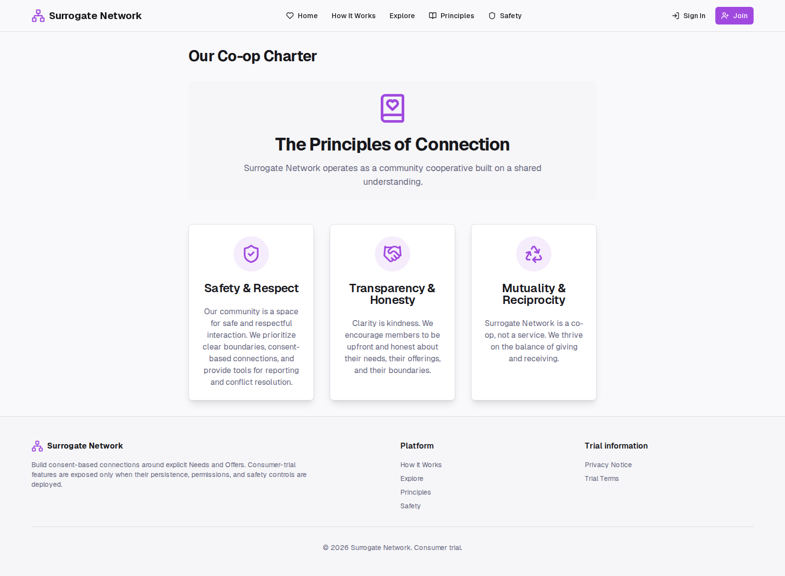

The Co-op Charter presents the product's connection principles in the actual public UI.

### Member marketplace and lifecycle

**07 — Member dashboard**

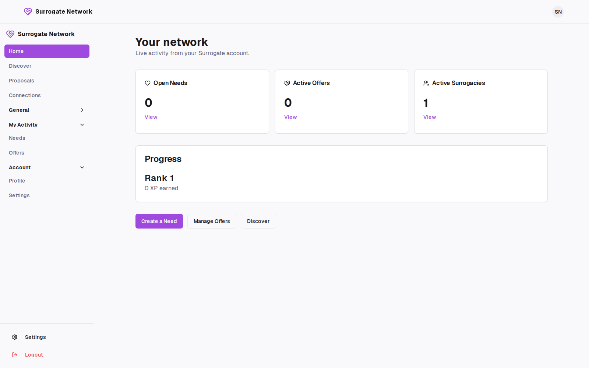

The authenticated dashboard shows live Need, Offer, and active Surrogacy counts for the trial member.

**08 — Discovery marketplace**

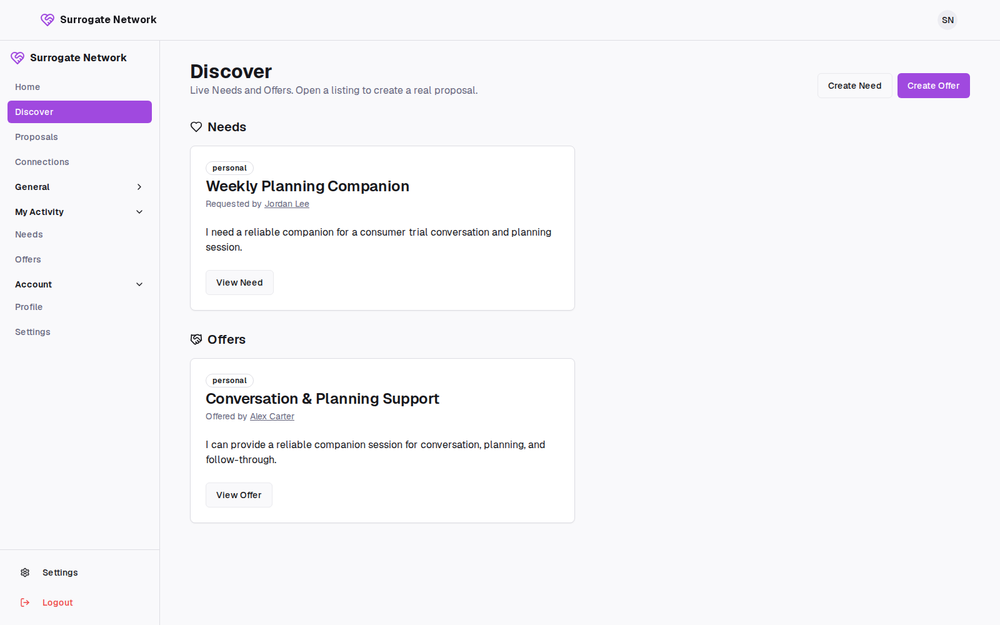

Discovery displays persisted Needs and Offers created during the same real trial journey.

**02 — Published Need**

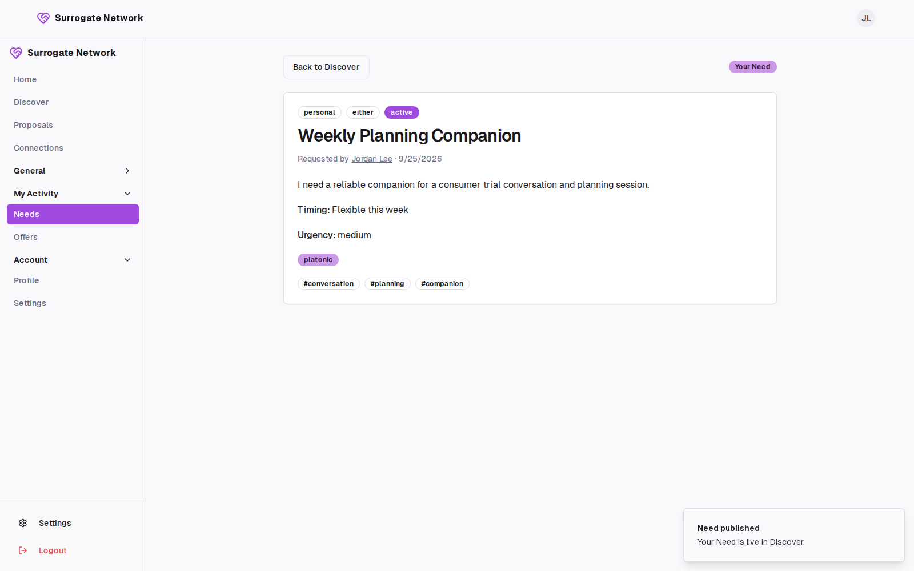

A Need is shown after real database creation, including the member shell and persisted state confirmation.

**09 — Published Offer**

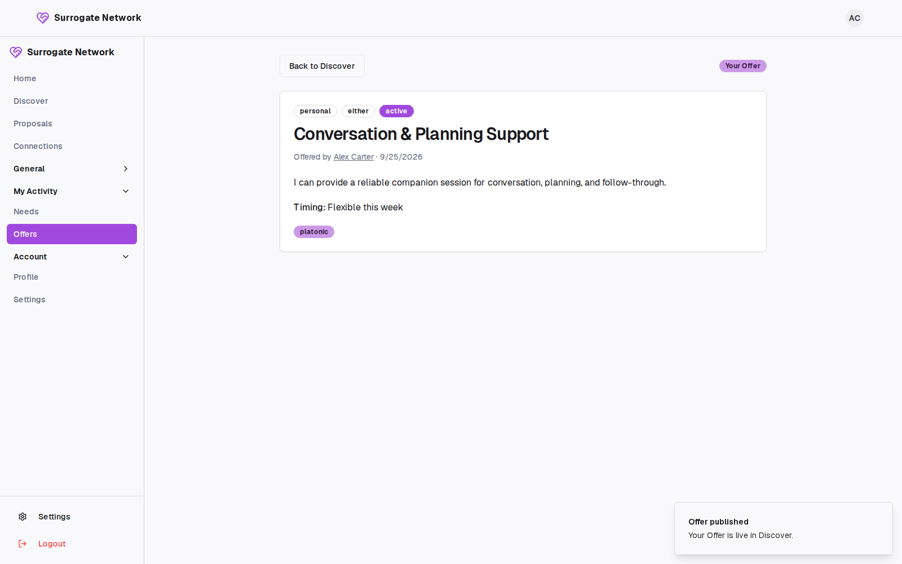

A complementary Offer is shown after real persistence.

**10 — Proposal composer**

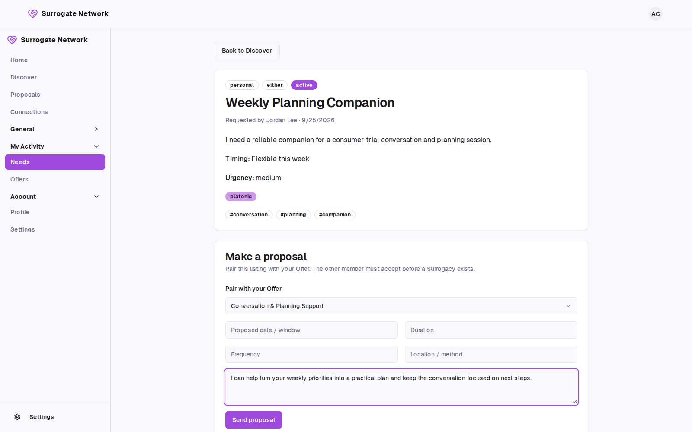

The composer is populated against the real Need and Offer records used by the trial journey.

**03 — Incoming Proposal**

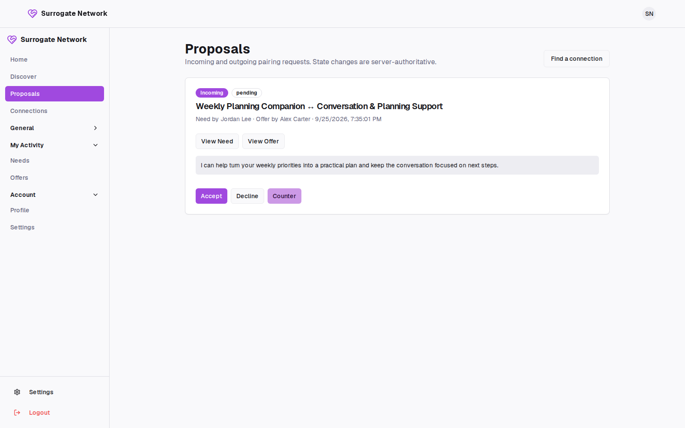

This is the actual browser page after Proposal persistence. Its intentionally compact card is the shipped UI state, not a rendered substitute. The visible Accept / Decline / Counter actions belong to the real proposal flow.

**12 — Active Surrogacy**

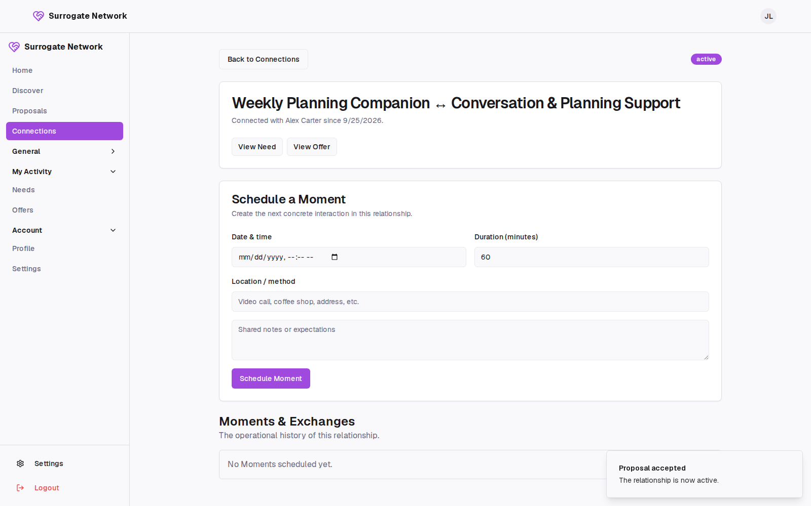

The accepted Proposal has been promoted into an active Surrogacy/Connection with the real Moment scheduling surface.

**04 — Completed Exchange**

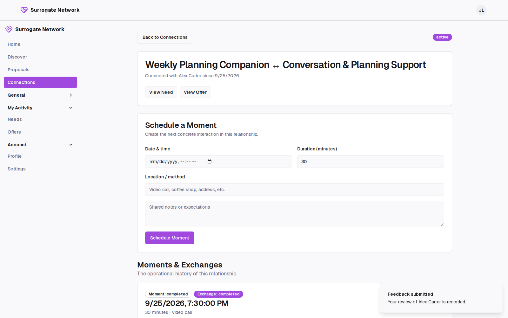

The relationship flow is shown after Moment completion and submitted Feedback, proving the lifecycle beyond proposal acceptance.

### Safety, account, and operations

**11 — Member profile safety controls**

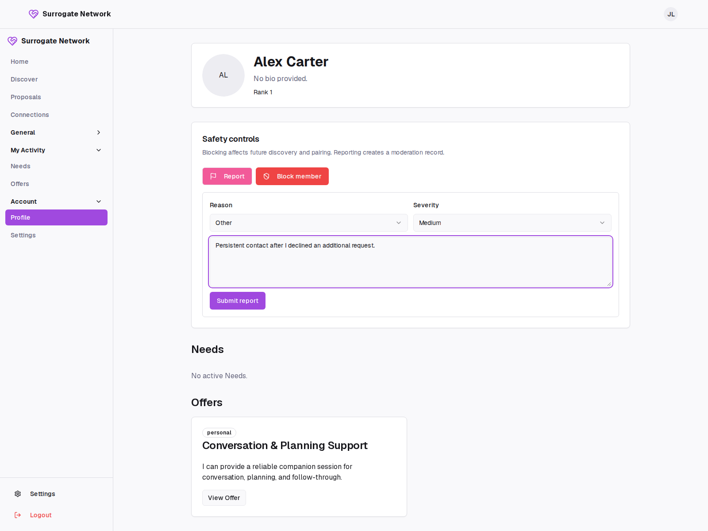

The authenticated member profile exposes the real report/block controls used by the trial.

**13 — Account privacy controls**

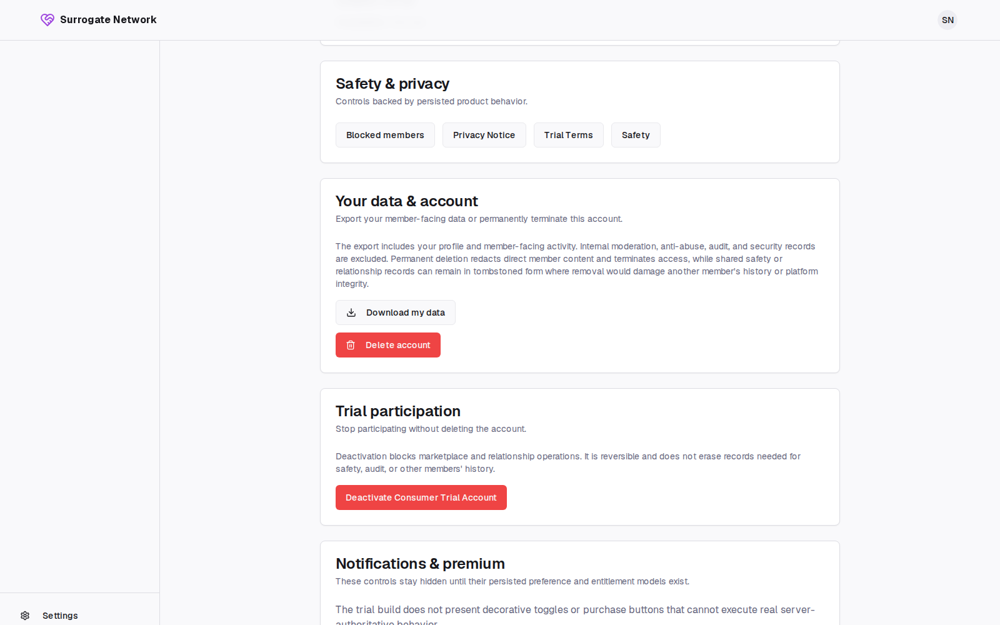

The account surface exposes real export, deactivation, deletion, Terms, and Privacy controls.

**14 — Admin Console**

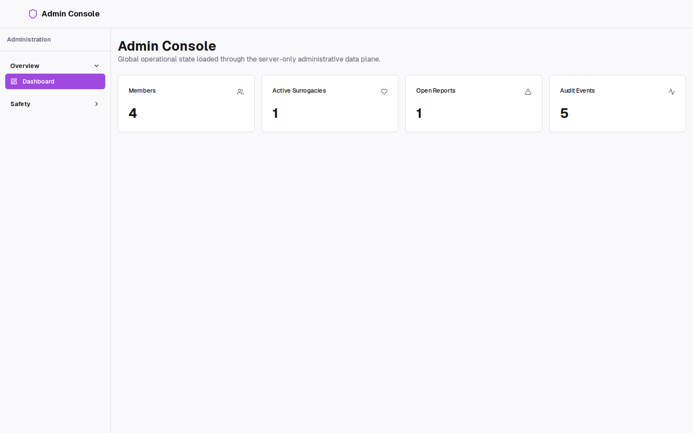

The separate authorized admin surface shows live operational counts without leaking admin controls into the member shell.

**15 — Moderation reports**

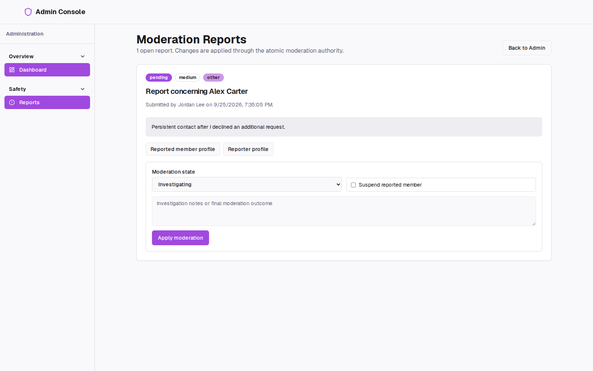

The moderation queue contains the report created through the member flow and exposes the real moderator action surface.

## Capture and promotion contract

CI must fail if any required source screenshot is absent or empty. The E2E workflow uploads the complete 16-frame set as `consumer-visual-evidence` so the exact-head runtime can be inspected before documentation promotion.

Promotion rules:

1. Capture only through the real Playwright/Supabase trial journey.
2. Inspect each individual source frame at readable size.
3. Promote the actual source PNG, not a stitched grid or manually reconstructed derivative.
4. Keep filenames stable so README, manifest, and visual-evidence references remain reviewable.
5. Replace stale individual frames when the UI materially changes.
6. Never use screenshots to imply behavior that the producing E2E path did not exercise.
7. Any commit that changes promoted screenshots or documentation references must pass the normal exact-head `QUALITY GATE` before merge.

## Privacy and safety boundary

Screenshot capture uses synthetic trial identities only. Do not capture production member data, secrets, service-role configuration, recovery links, raw tokens, internal error payloads, or provider credentials. Public documentation screenshots show product behavior, not operational secrets.
